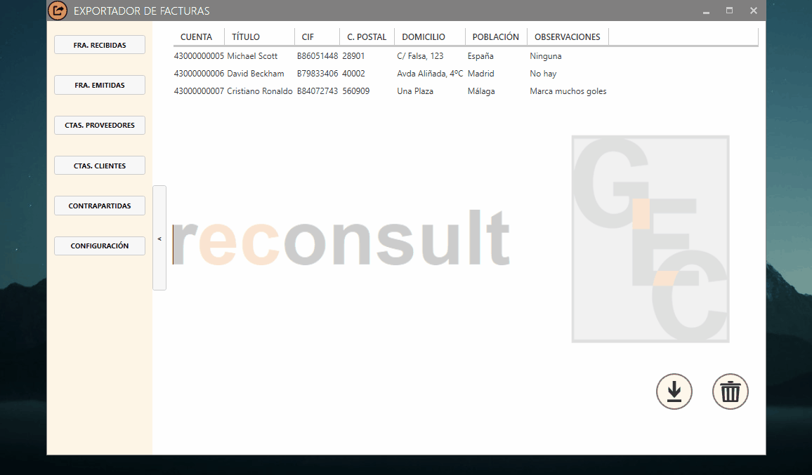
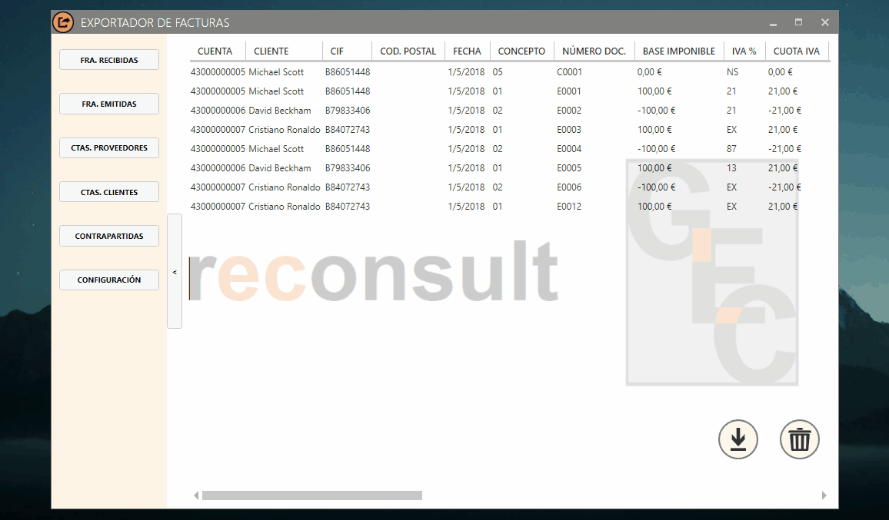
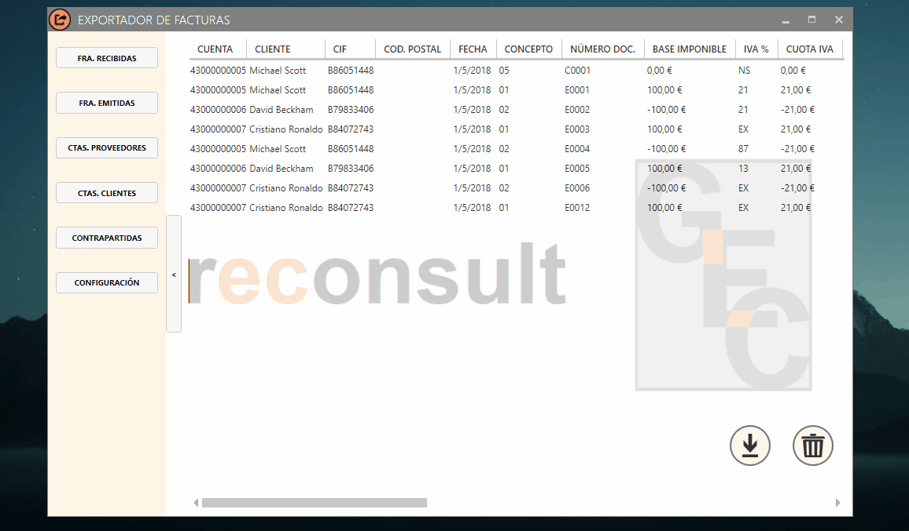
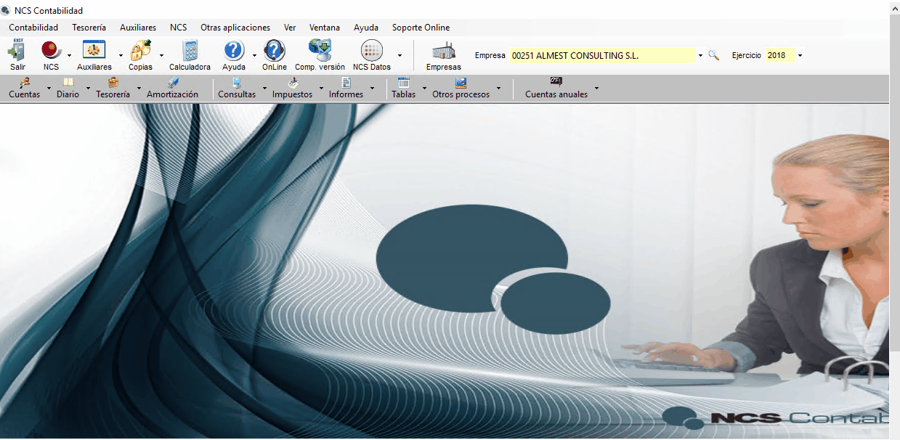

# Exportador de facturas - Manual de usuario

## Índice
- [Introducción](#intro)
- [Carga de datos desde Excel](#1)
  - [Solución de problemas](#1.1)
- [Revisión y generación del archivo de datos](#2)
  - [Configuración](#2.1)
  - [Cuentas](#2.2)
    - [Clientes y proveedores](#2.2.1)
    - [Validaciones automáticas para clientes y proveedores](#2.2.2)
    - [Contrapartidas](#2.2.3)
    - [Validaciones automáticas para contrapartidas](#2.2.4)
  - [Facturas](#2.3)
    - [Facturas emitidas y recibidas](#2.3.1)
    - [Validaciones automáticas para facturas](#2.3.2)
    - [Validaciones no automáticas para facturas](#2.3.3)
    - [Caso especial: intracomunitarias e inversión del sujeto pasivo](#2.3.4)
    - [Cobros y pagos](#2.3.5)
- [Carga del archivo en NCS](#3)

## ¿Para qué sirve este programa? 

El Exportador convierte datos de Excel a NCS Contabilidad, antiguamente conocido como DirectorNET. ¿Qué datos? Cuentas de clientes y proveedores, contrapartidas, todo tipo de facturación y cobros y pagos. El proceso consta de tres partes: carga de datos desde Excel, revisión y generación del archivo de datos desde la interfaz gráfica del programa y por último importación en NCS.

## 1. Carga de datos desde Excel 

El proceso se inicia con una hoja de Excel donde se encuentran los datos a exportar. Desde el botón **Datos** del menú superior se accede a la funcionalidad de MySQLForExcel.

La primera vez habrá que configurar la conexión. Desde MySQLForExcel, al hacer click en **New connection** se abrirá una ventana como esta:

Habla con tu administrador/a para los datos de acceso; solo tendrás que hacer esto una vez.

Con la conexión configurada, el proceso de carga de datos es relativamente sencillo: 
- Doble click en la conexión para entrar.
- Doble click en la empresa a la que importar.
- Click en la tabla correspondiente:
  - Cuentas de cliente
  - Cuentas de proveedor
  - Cuentas de contrapartida
  - Facturas emitidas
  - Facturas recibidas
- Selección de las filas y columnas a introducir.
- Click en **Append Excel data to table**.
- Mapeo de las columnas seleccionadas con las columnas internas.
- Click en **Append**.

El mapeo se hace de forma manual, ya que cada hoja de Excel puede ser diferente: algunas incluirán el nombre del cliente/proveedor y otras solo el CIF; las columnas tendrán distinto orden, etc. Aunque no es obligatorio, seleccionar el título de la columna junto con los datos y eliminar los mapeos previos (botón derecho - **Clear all mappings**) ayuda a evitar errores.

El siguiente gif muestra el proceso hasta la ventana de mapeo, incluyendo la selección del título de columna y la eliminación de los mapeos previos:

Para mapear, basta con arrastrar la columna de datos hasta la columna objetivo:

Al hacer click en **Append** es posible que aparezca un aviso si no todas las columnas de la BBDD reciben datos; no pasa nada, es una situación válida (de hecho, es la más habitual). Click en **Yes** y en **Ok**.

## 1.1 Solución de problemas 

- No se puede encontrar la columna X: A veces, tras un cambio en la BBDD, MySQLForExcel no permite añadir datos a la tabla, con el (poco descriptivo) mensaje de _No se puede encontrar la columna X_. En ese caso, la solución pasa por seleccionar cualquier otra tabla, hacer click en **Append Excel data to table** para abrir la ventana de mapeo y luego ir a **Advanced options**. Allí, en la parte inferior, están los mapeos guardados; tras borrarlos todos, el problema desaparecerá.

## 2. Revisión y generación del archivo de datos 

En este momento los datos ya se encuentran en la BBDD de la empresa elegida (en este tutorial, _gcmain\_bk_). El siguiente paso es revisar que todo está correcto y generar el archivo de datos para importar. Para ello, lo primero es iniciar sesión en el Exportador. Tras hacer doble click en el icono del programa, se abrirá la ventana de login. El programa busca automáticamente actualizaciones, y se reinicia si encuentra alguna; si no, aparecerá un mensaje diciendo _El programa está actualizado_. Click en **Ok**, click en el desplegable para seleccionar la empresa y finalmente introducción de usuario y contraseña.

## 2.1 Configuración 

Hay algunos datos que son fijos dentro de cada empresa y que pueden modificarse desde la configuración:

- Empresa
  - Código: el número de empresa asociado en NCS. Por defecto es **001**.
  - Ruta: el directorio donde se guardarán los archivos generados. Por defecto es **C:\\**.
- Cuentas generales
  - Clientes: cuenta de once dígitos a partir de la cual se generarán las nuevas cuentas para clientes no existentes. Por defecto es **43000000001**.
  - Proveedores: cuenta de once dígitos a partir de la cual se generarán las nuevas cuentas para proveedores no existentes. Por defecto es **41000000001**.
  - Gastos: cuenta de once dígitos usada como contrapartida para facturas de compras que no tienen una asignada. Por defecto es **60000000001**.
  - Ventas: cuenta de once dígitos usada como contrapartida para facturas de ventas que no tienen una asignada. Por defecto es **70000000001**.
- Retención, suplidos y bancos
  - Ret. emitidas: cuenta de once dígitos para retenciones de facturas emitidas. Por defecto es **47300000001**.
  - Ret. recibidas: cuenta de once dígitos para retenciones de facturas recibidas. Por defecto es **47510000001**.
  - Suplidos: cuenta de once dígitos para suplidos. Por defecto es **55500000001**.
  - Bancos: cuenta de once dígitos usada como contrapartida para cobros y pagos que no tienen una asignada. Por defecto es **57000000001**.
- IVAs
  - Emitidas: cuenta de once dígitos para IVA de facturas emitidas. Por defecto es **47700000001**.
  - Emitidas abonos: cuenta de once dígitos para IVA de devoluciones de facturas emitidas. Por defecto es **47700000002**.
  - Recibidas: cuenta de once dígitos para IVA de facturas recibidas. Por defecto es **47200000001**.
  - Recibidas abonos: cuenta de once dígitos para IVA de devoluciones de facturas recibidas. Por defecto es **47200000002**.					
Además, en la esquina inferior derecha aparece la versión del programa que está instalada.

Por último, desde Configuración existe la opción de crear una empresa nueva. Haciendo click en el botón con el símbolo **+** aparecerá un mensaje pidiendo el nombre de la nueva empresa. Solo están permitidos caracteres alfanuméricos estándar (es decir: ni eñe, ni espacios, ni puntos, ni comas...) y el nombre debe empezar por una letra. Si se introduce algún caracter prohibido será sustituido automáticamente. En el siguiente gif puede verse el proceso entero; _La Española_ se convierte en _la\_espanola_.

**IMPORTANTE**: Para acceder a la nueva empresa hay que volver a iniciar el programa!

## 2.2 Cuentas 

El proceso es idéntico para cuentas de clientes, proveedores y contrapartidas, aunque las contrapartidas tienen menos campos disponibles. 

### 2.2.1 Clientes y proveedores <a name="2.2.1">

Constan de siete campos:

- Código: Campo obligatorio, número de cuenta de once dígitos.
- Título: Campo obligatorio, nombre del cliente/proveedor.
- CIF: Campo obligatorio.
- C. Postal: Campo opcional.
- Domicilio: Campo opcional.
- Población: Campo opcional. Si se introduce una población no registrada en NCS, saltará un warning al importar los datos y será ignorada.
- Observaciones: Campo opcional.

En el siguiente gif se ven todas las opciones posibles: revisión, cambio de uno de los campos (en este caso, las observaciones), descarga del fichero de datos y borrado de cuentas.

**IMPORTANTE**: Es muy recomendable no borrar las cuentas. Es improbable que los códigos de clientes y proveedores cambien a lo largo del tiempo dentro de la misma empresa, y evita el tener que cargar el plan de cuentas cada vez que se use el Exportador.

### 2.2.2 Validaciones automáticas para clientes y proveedores <a name="2.2.2">

Al iniciar el Exportador o al generar el archivo de datos, las cuentas, cargadas desde la hoja de Excel, sufren una serie de validaciones automáticas:

- <u>Borrado de cuentas vacías:</u> Si se introduce una cuenta sin código, título ni CIF (por ejemplo, solo c. postal y domicilio), será borrada.
- <u>Borrado de cuentas no numéricas:</u> Si se introduce una cuenta con código no enteramente numérico (por ejemplo, 4300000AAAA), será borrada.
- <u>Conversión de cuentas a once dígitos:</u> Es posible introducir cuentas de diez dígitos, pero se les añadirá automáticamente un 0 en la sexta posición; 4399999999 se convertirá en 43999099999. Asimismo, si se introduce una cuenta de más de once dígitos será recortada, usando los primeros seis caracteres y los últimos cinco; 4300009999999900001 se convertirá en 43000000001.
- <u>Asignación de CIFs en cuentas vacías:</u> El CIF es un campo obligatorio. Si una cuenta lo tiene en blanco, se le asignará como CIF los primeros 25 caracteres de su título. Si tanto título como CIF están en blanco, se le asignará como CIF su código. El caso de que tanto CIF como título y código estén vacíos no es posible, ya que la primera validación habría borrado la cuenta.
- <u>Asignación de títulos en cuentas vacías:</u> El título es un campo obligatorio. Si una cuenta lo tiene en blanco, se le asignará como título su CIF.
- <u>Borrado de cuentas repetidas:</u> Se eliminarán las cuentas con título, código o CIF repetido, dejando en cada caso la más antigua.
- <u>Asignación de nuevos códigos de cuenta</u>: Es la validación más compleja. Hay un caso frecuente en el que al introducir **facturas** en el exportador se dispone de un título y un CIF, pero no del código asociado. El Exportador es suficientemente inteligente como para encontrar ese código si el título/CIF ya están en las cuentas registradas, pero ¿y si no? En ese caso, se trata de un cliente/proveedor nuevo, y debe tratarse como tal. Se creará en la tabla de cuentas correspondiente una nueva entrada con los datos disponibles en la factura, normalmente título, CIF y c. postal, y se generará el código nuevo como el mayor de los ya existentes + 1. Es decir:
  - Caso 1: Están previamente registradas la cuenta 43000000001, la 43000000002 y la 43000000003. El código de la nueva cuenta será el **43000000004**.
  - Caso 2: Están previamente registradas la cuenta 43000000001, la 43000000002 y la 43000000007. El código de la nueva cuenta será el **43000000008**; no se rellenan los huecos.
  - Caso 3: No hay cuentas previamente registradas. El código de la nueva cuenta será el código base de clientes/proveedores de la configuración, por defecto **43000000001** o **41000000001**.

### 2.2.3 Contrapartidas <a name="2.2.3">

Constan de dos campos:

- Cuenta: Campo obligatorio, número de cuenta de once dígitos.
- Contrapartida: Campo obligatorio, naturaleza de la contrapartida.

### 2.2.4 Validaciones automáticas para contrapartidas <a name="2.2.4">

- <u>Borrado de cuentas vacías:</u> Si se introduce una cuenta sin cuenta ni contrapartida, será borrada.
- <u>Borrado de cuentas no numéricas:</u> Igual que para cuentas de clientes/proveedores.
- <u>Conversión de cuentas a once dígitos:</u> Igual que para cuentas de clientes/proveedores.
- <u>Borrado de cuentas repetidas:</u> Igual que para cuentas de clientes/proveedores.

## 2.3 Facturas <a name="2.3">

El proceso es idéntico para facturas emitidas y recibidas, así como para cobros y pagos.

### 2.3.1 Facturas emitidas y recibidas <a name="2.3.1">

Constan de 24 campos, la gran mayoría autoexplicativos:

- Cuenta: Número de cuenta de once dígitos.
- Cliente/Proveedor: Título de la cuenta.
- CIF
- Cod. Postal: Solo se usa en la creación de nuevas cuentas (ver apartado 2.2.2).
- Fecha: Si no se proporciona **se usará el día en curso.**
- Concepto: Código de concepto en NCS.
- Número Doc
- Base Imponible
- IVA %: Dos caracteres, sin espacios, decimales ni símbolos de %
- Cuota IVA
- Importe
- Suplidos
- Retención
- Tipo ret: Clave de retención en NCS.
- Clave sel: Clave de selección en NCS.
- Observaciones
- Num. Asiento
- Tipo Operacion
- Serie Asiento
- Contrapartida
- Cta. Contrapartida
- Doc. Origen
- Fecha Doc. Origen: Necesaria para las devoluciones. Si no se proporciona y el asiento lo requiere, se usará la fecha de factura. Si no se proporciona tampoco la fecha de factura, se usará el día en curso.

En el siguiente gif se ven todos los campos. Aunque no se muestran aquí, las opciones posibles son iguales que las de cuentas: revisión, modificación de campos, descarga del fichero de datos y borrado de facturas.

### 2.3.2 Validaciones automáticas para facturas <a name="2.3.2">

Al iniciar el Exportador o al generar el archivo de datos, las facturas, cargadas desde la hoja de Excel, sufren una serie de validaciones automáticas:

- <u>Validación de cuentas:</u> Dado que puede haber cuentas nuevas, se realizan todas las validaciones de cuentas explicadas en el apartado anterior.
- <u>Incorporación de nuevas cuentas:</u> Si en la factura hay cuentas no existentes, se incorporan a la BBDD.
- <u>Información de cuentas preexistentes:</u> Si en la factura hay cuentas preexistentes con falta de campos (por ejemplo, si en la factura está el CIF de un cliente, pero no su título ni su código), se carga esa información desde la BBDD.
- <u>Información de contrapartidas preexistentes:</u> Si en la factura hay un código de contrapartida ya existente en la BBDD, se actualizará con la naturaleza contrapartida correspondiente a dicho código. Ejemplos: 
  - Caso 1: En la BBDD existe la contrapartida **60000000001 Compras de mercaderías** y los datos de la factura son **60000000001 Compras diversas**; se actualizará la factura a **60000000001 Compras de mercaderías**.
  - Caso 2: En la BBDD existe la contrapartida **60000000001 Compras de mercaderías** y los datos de la factura son **60000000001**, sin naturaleza; se actualizará la factura a **60000000001 Compras de mercaderías**.
  - Caso 3: En la BBDD existe la contrapartida **60000000001 Compras de mercaderías** y los datos de la factura son **Compras de mercaderías**, sin código; se actualizará la factura a **60000000001 Compras de mercaderías**.
  - Caso 4: En la BBDD existe la contrapartida **60000000001 Compras de mercaderías** y los datos de la factura son **60000000002 Compras diversas**; la factura no se actualizará y habrá que validarla manualmente, como se verá a continuación.
- <u>Cantidades a cero:</u> Si no se han proporcionado datos de base imponible, cuota de IVA, retención o suplidos se asignará automáticamente el valor de 0€.
- <u>Cálculo del importe total:</u> En la inmensa mayoría de casos, salvo en algunos especiales que se verán a continuación, el importe se calcula automáticamente **aunque se proporcione la información del mismo**. El valor total es el resultado de la ecuación _Base imponible + Cuota IVA - Retención_. Los suplidos van aparte.
- <u>Cálculo del código de concepto</u>: Si no se proporciona, el código de concepto por defecto es **01** para facturas emitidas, **02** para devoluciones de facturas emitidas, **03** para facturas recibidas y **04** para devoluciones de facturas recibidas.
- <u>Eliminación de facturas con importe cero</u>: NCS no admite asientos sin importe, por lo que las facturas con importe cero se eliminan automáticamente.
- <u>Cálculo del tipo de operación</u>: Si no se proporciona, el tipo de operación por defecto es **IV01**. Si se proporciona en un formato incorrecto, el Exportador intentará modificarlo automáticamente:
  - Caso 1: Se da **1**; se actualiza a **IV01**.
  - Caso 2: Se da **01**; se actualiza a **IV01**.
  - Caso 3: Se da **IV1**; se actualiza a **IV01**.
  - Caso 4: Se da **K**, correspondiente a IV20 en los viejos códigos de DirectorNET; se actualiza a **IV20**.
  - Caso 5: Se da, por ejemplo, **Operación 1**; la factura no se actualizará y la importación fallará, el Exportador no puede controlar todos los casos!
- <u>Cálculo del porcentaje de IVA</u>: Si no se proporciona, se asume que el porcentaje de IVA es **EX**. Si se proporciona en un formato incorrecto, el Exportador intentará modificarlo automáticamente:
  - Caso 1: Se da **21 %**; se actualiza a **21**.
  - Caso 2: Se da **21.00%**; se actualiza a **21**.
  - Caso 3: Se da **21%**; se actualiza a **21**.
  - Caso 4: Se da **Exento**; se actualiza a **EX**.
  - Caso 5: Se da, por ejemplo, **87%**; la factura no se actualizará y habrá que validarla manualmente, como se verá a continuación.
- <u>Cálculo de contrapartidas</u>: Si no se ha proporcionado ninguna contrapartida para la factura, se usarán los valores por defecto:
  - Caso 1: Es una factura emitida; se usará la cuenta general de ventas de la configuración y la naturaleza será **GENERAL VENTAS**.
  - Caso 2: Es una factura recibida; se usará la cuenta general de gastos de la configuración y la naturaleza será **GENERAL VENTAS**.

### 2.3.3 Validaciones no automáticas para facturas <a name="2.3.3">

Las validaciones automáticas están diseñadas _ad hoc_ para GreConsult, y suelen ser suficientes. Sin embargo, para hacer el sistema más robusto se han añadido algunas comprobaciones extra que se llevan a cabo al descargar el archivo de datos:

- <u>Todas las contrapartidas existen</u>: Si las facturas tienen contrapartidas no registradas en la BBDD, hay que añadirlas. Esta validación es semiautomática, ya que permite tanto cancelar la exportación para revisarlas como añadirlas automáticamente y generar el archivo.
- <u>Los porcentajes de IVA son correctos</u>: Si alguna factura tiene un porcentaje de IVA no válido (los aceptados son EX, NS, 21, 18, 16, 10, 8, 7 y 4), no se puede realizar la exportación.
- <u>Todas las retenciones tienen clave</u>: Si alguna factura tiene cuota de retención pero no clave, no se puede realizar la exportación.
- <u>Caso particular de arrendamientos</u>: Si alguna factura tiene clave de retención **M** y tipo de operación distinto de **IV13**, no se puede realizar la exportación.

Las validaciones no automáticas siguen todas el mismo patrón: salta un aviso indicando qué pasa y las filas erróneas quedan marcadas en gris. Tras corregir los errores, la exportación será permitida:

### 2.3.4 Caso especial: intracomunitarias e inversión del sujeto pasivo <a name="2.3.4">

Las facturas de adquisiciones intracomunitarias e inversión del sujeto pasivo, correspondientes a los tipos de operación **IV02**, **IV20** e **IV17**, suelen aparecer en el Excel únicamente con base imponible. Por ello, el Exportador las trata de forma diferente:

- El porcentaje de IVA siempre será **21**, aunque no se proporcione información.
- La cuota de IVA se calculará como _Base imponible * 0.21_.
- A continuación, el importe total se calculará como _Base imponible + Cuota IVA_.

### 2.3.5 Cobros y pagos <a name="2.3.5">

Los cobros y pagos funcionan exactamente igual que las facturas emitidas y recibidas con algunas pequeñas diferencias:

- El código de concepto debe ser **05** para cobros o **06** para pagos. Si no se proporciona esta información el Exportador **no las considerará cobros/pagos sino facturas emitidas/recibidas**.
- Habitualmente este tipo de facturas solo tienen una cuota, correspondiente al cobro/pago (es decir, no están desglosadas en base imponible, cuota IVA y demás). **Esa cantidad debe estar localizada en la columna Importe**, no en Base imponible ni en ninguna otra.
- En el caso de que un cobro/pago no tenga contrapartida asignada se usará la cuenta general de bancos de la configuración y la naturaleza será **GENERAL COBROS/PAGOS**.

## 3. Carga del archivo en NCS <a name="3">

Una vez generados los archivos de cuentas y facturas pueden importarse en NCS desde **Auxiliares** - **Comunicaciones** - **Recibir datos**. En el caso de cuentas no hay que hacer nada más que indicar la ruta del fichero; en el caso de las facturas hay que marcar la casilla de **Núm asiento automático** o el asiento quedará vacío. Tras **Aceptar**, click en **Recibir** y el proceso habrá finalizado.

