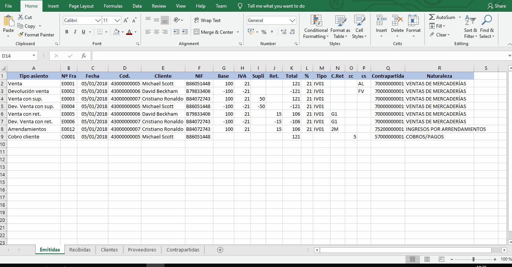
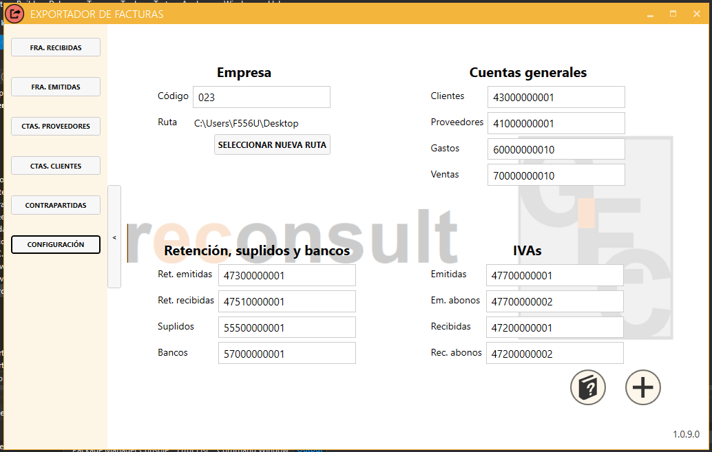

# Exportador de facturas - Manual de usuario

## ¿Para qué sirve este programa?

El Exportador convierte datos de Excel a NCS Contabilidad, antiguamente conocido como DirectorNET. ¿Qué datos? Cuentas de clientes y proveedores, contrapartidas, todo tipo de facturación y cobros y pagos. El proceso consta de tres partes: carga de datos desde Excel, revisión y generación del archivo de datos desde la interfaz gráfica del programa y por último importación en NCS.

## 1. Carga de datos desde Excel

El proceso se inicia con una hoja de Excel donde se encuentran los datos a exportar. Desde el botón **Datos** del menú superior se accede a la funcionalidad de MySQLForExcel.

La primera vez habrá que configurar la conexión. Desde MySQLForExcel, al hacer click en **New connection** se abrirá una ventana como esta:

Habla con tu administrador/a para los datos de acceso; solo tendrás que hacer esto una vez.

Con la conexión configurada, el proceso de carga de datos es relativamente sencillo: 
- Doble click en la conexión para entrar.
- Doble click en la empresa a la que importar.
- Click en la tabla correspondiente:
  - Cuentas de cliente
  - Cuentas de proveedor
  - Cuentas de contrapartida
  - Facturas emitidas
  - Facturas recibidas
- Selección de las filas y columnas a introducir.
- Click en **Append Excel data to table**.
- Mapeo de las columnas seleccionadas con las columnas internas.
- Click en **Append**.

El mapeo se hace de forma manual, ya que cada hoja de Excel puede ser diferente: algunas incluirán el nombre del cliente/proveedor y otras solo el CIF; las columnas tendrán distinto orden, etc. Aunque no es obligatorio, seleccionar el título de la columna junto con los datos y eliminar los mapeos previos (botón derecho - **Clear all mappings**) ayudan a evitar errores.

El siguiente gif muestra el proceso hasta la ventana de mapeo, incluyendo la selección del título de columna y la eliminación de los mapeos previos:

Para mapear, basta con arrastrar la columna de datos hasta la columna objetivo:

Al hacer click en **Append** es posible que aparezca un aviso si no todas las columnas de la BBDD reciben datos; no pasa nada, es una situación válida (de hecho, es la más habitual). Click en **Yes** y en **Ok**.

## 1.1 Solución de problemas

- No se puede encontrar la columna X: A veces, tras un cambio en la BBDD, MySQLForExcel no permite añadir datos a la tabla, con el (poco descriptivo) mensaje de _No se puede encontrar la columna X_. En ese caso, la solución pasa por seleccionar cualquier otra tabla, hacer click en **Append Excel data to table** para abrir la ventana de mapeo y luego ir a **Advanced options**. Allí, en la parte inferior, están los mapeos guardados; tras borrarlos todos, el problema desaparecerá.

## 2. Revisión y generación del archivo de datos

En este momento los datos ya se encuentran en la BBDD de la empresa elegida (en este tutorial, _gcmain\_bk_). El siguiente paso es revisar que todo está correcto y generar el archivo de datos para importar. Para ello, lo primero es iniciar sesión en el Exportador. Tras hacer doble click en el icono del programa, se abrirá la ventana de login. El programa busca automáticamente actualizaciones, y se reinicia si encuentra alguna; si no, aparecerá un mensaje diciendo _El programa está actualizado_. Click en **Ok**, click en el desplegable para seleccionar la empresa y finalmente introducción de usuario y contraseña.

## 2.1 Configuración

Hay algunos datos que son fijos dentro de cada empresa y que pueden modificarse desde la configuración:

- Empresa
  - Código: el número de empresa asociado en NCS. Por defecto es **001**.
  - Ruta: el directorio donde se guardarán los archivos generados. Por defecto es **C:\\**.
- Cuentas generales
  - Clientes: cuenta de once dígitos a partir de la cual se generarán las nuevas cuentas para clientes no existentes. Por defecto es **43000000001**.
  - Proveedores: cuenta de once dígitos a partir de la cual se generarán las nuevas cuentas para proveedores no existentes. Por defecto es **41000000001**.
  - Gastos: cuenta de once dígitos usada como contrapartida para facturas de compras que no tienen una asignada. Por defecto es **60000000001**.
  - Ventas: cuenta de once dígitos usada como contrapartida para facturas de ventas que no tienen una asignada. Por defecto es **70000000001**.
- Retención, suplidos y bancos
  - Ret. emitidas: cuenta de once dígitos para retenciones de facturas emitidas. Por defecto es **47300000001**.
  - Ret. recibidas: cuenta de once dígitos para retenciones de facturas recibidas. Por defecto es **47510000001**.
  - Suplidos: cuenta de once dígitos para suplidos. Por defecto es **55500000001**.
  - Bancos: cuenta de once dígitos usada como contrapartida para cobros y pagos que no tienen una asignada. Por defecto es **57000000001**.
- IVAs
  - Emitidas: cuenta de once dígitos para IVA de facturas emitidas. Por defecto es **47700000001**.
  - Emitidas abonos: cuenta de once dígitos para IVA de devoluciones de facturas emitidas. Por defecto es **47700000002**.
  - Recibidas: cuenta de once dígitos para IVA de facturas recibidas. Por defecto es **47200000001**.
  - Recibidas abonos: cuenta de once dígitos para IVA de devoluciones de facturas recibidas. Por defecto es **47200000002**.					
Además, en la esquina inferior derecha aparece la versión del programa que está instalada.

Por último, desde Configuración existe la opción de crear una empresa nueva. Haciendo click en el botón con el símbolo **+** aparecerá un mensaje pidiendo el nombre de la nueva empresa. Solo están permitidos caracteres alfanuméricos estándar (es decir: ni eñe, ni espacios, ni puntos, ni comas...) y el nombre debe empezar por una letra. Si se introduce algún caracter prohibido será sustituido automáticamente. En el siguiente gif puede verse el proceso entero; _La Española_ se convierte en _la\_espanola_.

**IMPORTANTE**: Para acceder a la nueva empresa hay que volver a iniciar el programa!

## 5. Cuentas

Cuentas de cliente, de proveedores y contrapartidas. Contar las reglas que tienen. Borrado.

### 5.1 Campos obligatorios

CIF, Nombre, Cuenta. Valores por defecto. Qué pasa si no los das. Etc.

### 5.2 Campos no obligatorios

Código postal, domicilio etc.

## 6. Facturas

Facturas de clientes o de proveedores. Borrado.

### 6.1 Cuenta
### 6.2 Número documento
### 6.3 Clave retención etc
### 6.4 Número asiento (hay que tocar NCS)
### 6.5 Validaciones

## 7. Carga del archivo en NCS

Se genera un XML que puede inspeccionarse con el bloc de notas. Se carga desde Auxiliares - Recibir datos.

### Excel to Director Invoice Exporter - Releases

#### v1.0 
Added Continuous Delivery for the app with Squirrel as a feature. New notifications for updates.
#### v1.1
Changing access file to handle both local and remote connections.
#### v1.2 - v1.3
Bug fixing: update problem - Squirrel wasn't properly configured.
#### v1.4
Minor (but critical) change: New process to numerate accounts.
#### v1.5
Migrated to Entity Framework. About the test suite: New UI tests with Selenium. More unit tests added - coverage up +15%. New DB tests added, now that everything DB-related runs on EF.
#### v1.6
Adding missing .msi files as part of the main installation file - latest .NET connector is not compatible with EF+MySQL, so it's mandatory to store a backup of the previous version.
#### v1.7
Bug fixing: the program doesn't allow having duplicate CIFs anymore.
#### v1.8
Bug fixing: 'Create new company' feature was duplicating the generic DB schema instead of the chosen one.
#### v1.9
New requirement: adding support for invoices just for supplies, with no value at all, according to Spanish legislation.
